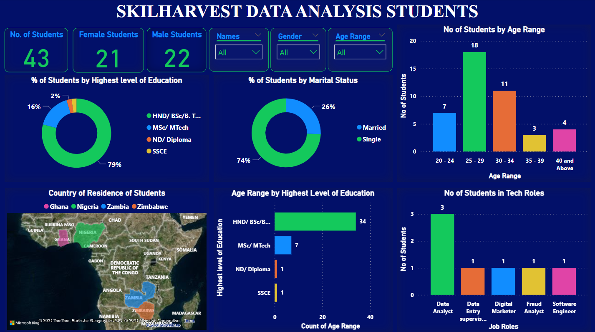

# SkillHarvest Data Analysis Training Cohort 2


I did an exploratory data analysis (EDA) on the stationaries supply of the SkilHarvest company to find various trends and insight for making informed decisions

**Documentation Outline**

-[Project Overview](#project-overview)

-[Data Source](#data-source)

-[Tools used](#tools-used)

-[Data Cleaning and Preparation](#data-cleaning-and-preparation)

-[Data Analysis](#data-analysis)

-[Tables containing Analysis](#tables-containing-analysis)

-[Results/Findings](#results-findings)

## Project Overview
---

This repository hosts a data analysis project focused on exploring insights and trends within the SkillHarvest Data Analysis Training Class for Cohort 2. The project utilizes a real-time Google Sheet list containing comprehensive data of all students enrolled in the program. The dataset includes information such as names, age ranges, highest level of education, phone numbers, email addresses, countries, gender, occupation, and marital status of each student.

The primary objective of this project is to leverage data analysis techniques to uncover valuable insights that can enhance understanding and decision-making within the SkillHarvest program. By examining the provided dataset, the project aims to identify patterns, correlations, and trends that could inform various aspects of the training program, including curriculum design, student support services, and outreach strategies.


## Data Source
---
The data source for this project is a Google Sheet list containing the information of all students enrolled in the SkillHarvest Data Analysis Training Class for Cohort 2.

The data can be found here [https://docs.google.com/spreadsheets/d/1j683Iej1rexP0ZklCt4CQSEjTZpUGAfhIirowQNtk80/edit#gid=120058417]

## Tools Used
---
Google Sheet to collect the data

Microsoft Power BI to clean, transform, analyze, and visualize the data

## Data Visualization

To illustrate patterns and relationships present in the data, facilitating easier interpretation and communication of insights.




## Trend Analysis
```
To identify trends and patterns over time or across different demographic segments to uncover potential factors influencing student engagement, retention, and success within the program

